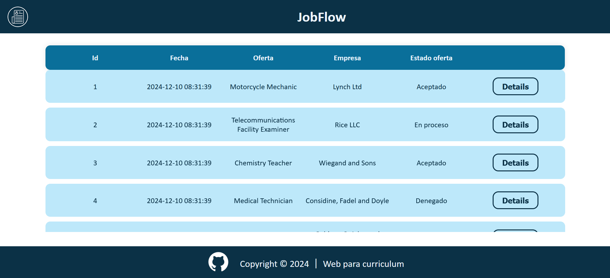
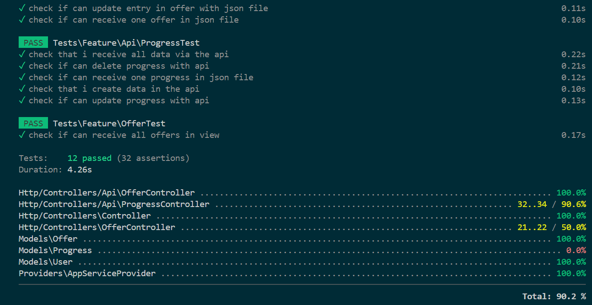
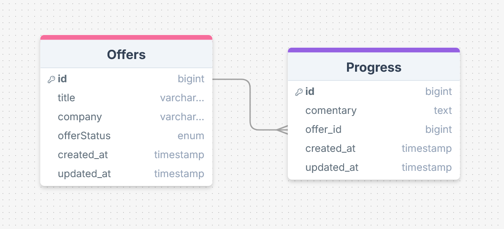

# Job Flow 💼

## Description
This project consists of a website for registering offers.

We can see a table with our offers and we can also see each of them individually and see their comments.

We can also create, modify, view and delete an offer.

## Proyect guide
On entering the page we see a table where we can view each of the offers, where we find the date when we created it, the name of the type of offer and the state in which it is.

Right next to it we have a button where we can access each of our offers and see if we have any comments added about how our offer is going, etc.


<p align="center"><em>Home view</em></p>

This is the main view where we see the table with offers.


<p align="center"><em>Show view</em></p>

This is the secondary view where we see the table with the comments.

## Installation requierements
- XAMPP

- Install the composer

- Install Nodejs

- Xdebug

-Postman

## 💻 Installation
- Clone repository
```
https://github.com/Inma0711/Employment-Project.git
```
- Install the composer

```
composer install
```
- Install Nodejs

```
npm install
```

-Create a '.env' for example:
    - DB_CONNECTION=mysql
    - DB_DATABASE=db_jobFLow

-Generate all the tables and fake values:

```
php artisan migrate:fresh --seed
```
-Run Laravel:

```
php artisan serve
```
-Run npm:

```
npm run dev
```

## API Endpoints
5 endpoints have been created, one for the offer table and one for the progress table.

### Offer
-GET (read all):

```
http://127.0.0.1:8000/api/offers
```
-GET BY ID:

```
http://127.0.0.1:8000/api/offers/{id}
```
-POST:

```
http://127.0.0.1:8000/api/offers
```
-DELETE:

```
http://127.0.0.1:8000/api/offers/{id}
```
-PUT:

```
http://127.0.0.1:8000/api/offers/{id}
```

### Progress

-GET (read all):

```
http://127.0.0.1:8000/api/progresses
```
-GET BY ID:

```
  http://127.0.0.1:8000/api/progresses/{id}
```
-POST:

```
 http://127.0.0.1:8000/api/offers/{id}/progresses
```
-DELETE:

```
 http://127.0.0.1:8000/api/progresses/{id}
```
-PUT:

```
 http://127.0.0.1:8000/api/progresses/{id}
```

## Test
Here you will find all the tests we have done.

to test we put the following command: php artisan test --coverage



## Database diagram


## Technologies and Tools

<a href='https://github.com/shivamkapasia0' target="_blank"></a>
<a href='https://github.com/shivamkapasia0' target="_blank"></a>
<a href='https://github.com/shivamkapasia0' target="_blank"></a>
<a href='https://github.com/shivamkapasia0' target="_blank"></a>
<a href='https://github.com/shivamkapasia0' target="_blank"></a>
<a href='https://github.com/shivamkapasia0' target="_blank"></a>

<a href='https://github.com/shivamkapasia0' target="_blank"></a>
<a href='https://github.com/shivamkapasia0' target="_blank"></a>
<a href='https://github.com/shivamkapasia0' target="_blank"></a>
<a href='https://github.com/shivamkapasia0' target="_blank"></a>
<a href='https://github.com/shivamkapasia0' target="_blank"></a>

## Author

This project was fully developed by: 

[Inmaculada Gonzalez Aguilar](https://github.com/Inma0711)